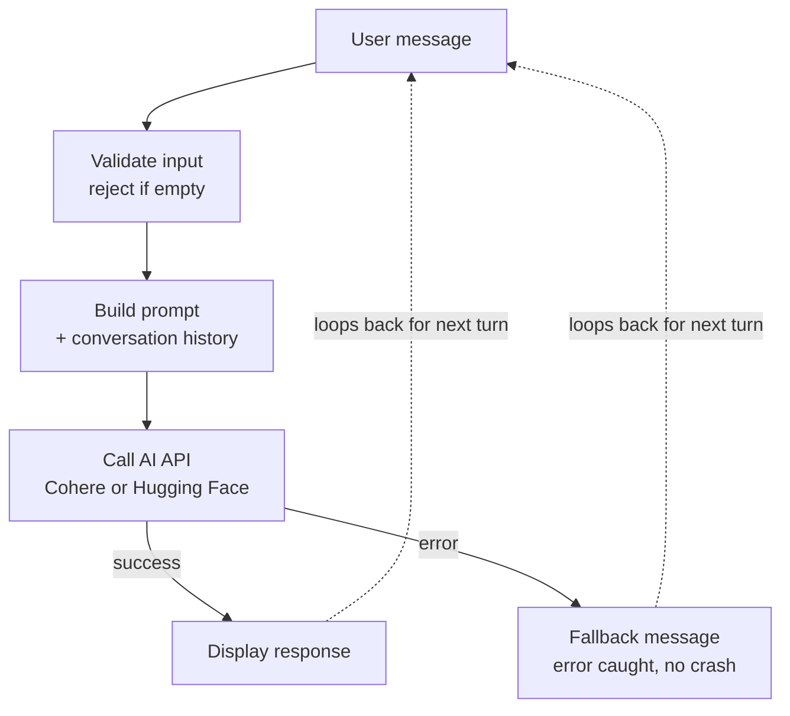

# Smart AI Chatbot

A terminal-based AI chatbot built for **TechMaster Academy — Phase 04 / Project 04**.
It sends real user messages to an AI model (Cohere or Hugging Face) through a
documented prompt-handling and chatbot-logic flow, keeps conversation history
across turns, and handles API errors without crashing.

## Features

- Real AI API integration — Cohere and Hugging Face, switchable via one setting
- Structured prompt building with a system prompt and conversation history
- Clean chatbot loop: input validation, exit command, error handling
- Conversation history capped to a fixed number of turns
- API credentials loaded from environment variables — never hardcoded
- A sanity-check test script covering the project's core behavior

## User Experience Flow



The terminal experience itself is lightly styled for readability: a boxed
welcome banner, colored `You:` / `AI:` labels, and a brief "AI is typing..."
indicator while waiting on the API — see `src/utils.py` for the helpers
behind this (`print_banner`, `colorize`, `show_typing_indicator`).

## Project Structure

```
smart-ai-chatbot/
├── src/
│   ├── api_client.py    # Talks to the AI provider (Cohere / Hugging Face)
│   ├── chatbot.py        # Main conversation loop and input handling
│   ├── prompts.py        # Prompt building and conversation history
│   └── utils.py          # Error handling, config, and terminal UX helpers
├── tests/
│   └── sanity_checks.py  # Sanity checks for the checklist below
├── .env.example           # Template for your local environment variables
├── .gitignore
├── requirements.txt
├── main.py
└── README.md
```

## Setup

1. **Clone the repository and enter the project folder**

   ```bash
   git clone <your-repo-url>
   cd Phase-4-Smart-Ai-Chatbot
   ```

2. **Create and activate a virtual environment** (recommended)

   ```bash
   python -m venv venv
   source venv/bin/activate      # macOS / Linux
   venv\Scripts\activate         # Windows
   ```

3. **Install dependencies**

   ```bash
   pip install -r requirements.txt
   ```

4. **Set up your environment variables**

   Copy the example file and fill in your own values:

   ```bash
   cp .env.example .env
   ```

   Then edit `.env`:

   | Variable          | Required when...          | Description                              |
   |-------------------|----------------------------|-------------------------------------------|
   | `AI_PROVIDER`     | always                     | `cohere` or `huggingface`                 |
   | `COHERE_API_KEY`  | `AI_PROVIDER=cohere`       | Your Cohere API key                       |
   | `COHERE_MODEL`    | `AI_PROVIDER=cohere`       | Cohere model name (defaults provided)     |
   | `HF_API_KEY`      | `AI_PROVIDER=huggingface`  | Your Hugging Face access token            |
   | `HF_MODEL`        | `AI_PROVIDER=huggingface`  | The Hugging Face model to call            |

   `.env` is listed in `.gitignore` and will never be committed.

## Running the Chatbot

```bash
python main.py
```

Type a message and press Enter. Type `exit` at any time to end the conversation.

## Running the Sanity Checks

```bash
python tests/sanity_checks.py
```

This checks, without making any real API calls by default:

- Empty/whitespace input is rejected
- The exit command is recognized case-insensitively
- Prompts are built correctly (system prompt + history + new message)
- Conversation history is stored and trimmed correctly
- An unknown/misconfigured provider fails gracefully instead of crashing
- Whether an API key is present for the configured provider
- `require_env()` returns a value or raises a clear error when missing
- `safe_call()` returns a fallback instead of raising
- `retry_call()` retries transient failures and re-raises after exhausting them
- `mask_key()` never leaks a full secret, and `colorize()` respects the enabled flag

To also make one real API call as part of the checks (uses your quota):

```bash
RUN_LIVE_API_CHECK=1 python tests/sanity_checks.py
```

## Error Handling

Every AI API call is wrapped in a `try/except` block, both inside
`api_client.py` (provider-specific errors) and in the main chatbot loop
(`chatbot.py`), so a failed request never crashes the conversation — the
user sees a friendly message and can keep chatting.

## Notes

- No deep learning, fine-tuning, RAG, vector databases, or cloud deployment
  are used — this project focuses on API integration, prompt handling, and
  chatbot logic, as scoped for Phase 04.
- The comparison between Cohere and Hugging Face here is about developer
  experience, not performance.
